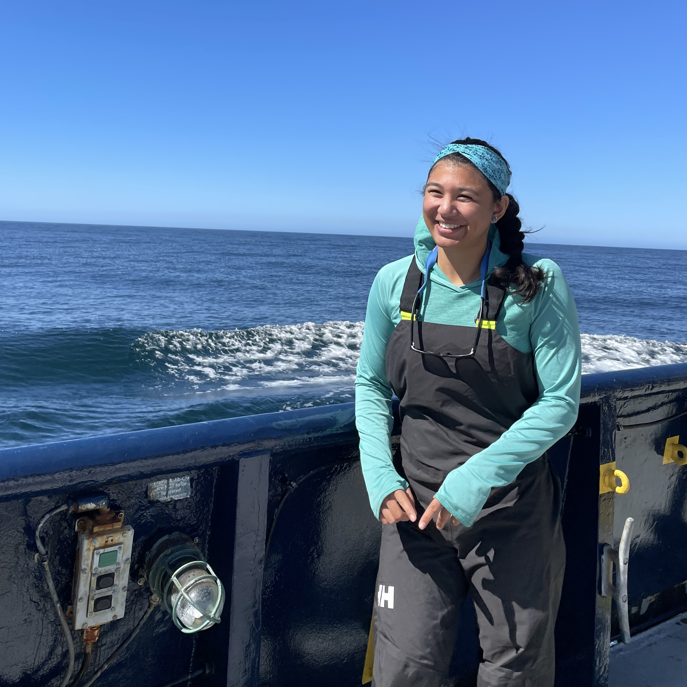
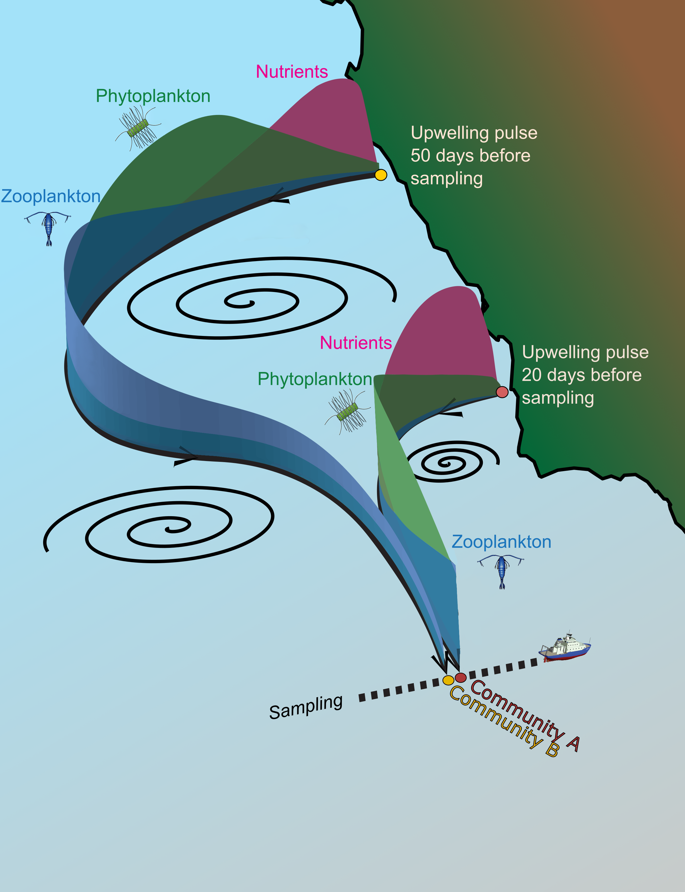

Shailja Gangrade (pronounced "SHELL-ja Gung-RAH-day") is a biological oceanographer, marine plankton ecologist, educator, and postdoctoral research associate in the Department of Earth, Environmental & Planetary Sciences at Brown University. She received her PhD in Oceanongraphy from Scripps Institution of Oceanography (SIO) at UC San Diego in 2024. At SIO, Shailja was awarded an NSF Graduate Research Fellowship and was advised by Prof. Peter Franks. She conducted much of her research within the [California Current Ecosystem Long-Term Ecological Research](https://ccelter.ucsd.edu) program, and her dissertation investigated plankton patchiness at mesoscale fronts and filaments, with a focus on drivers, dynamics, and implications in the California Current System.

Shailja's [current research]() continues to focus on the physical and biological controls on plankton ecosytems across ocean margins (from coastal to offshore regions). Her work incorporates fieldwork on research vessels to collect physical and biogeochemical observations, as well as analysis of  in situ and remote sensing measurements. Shailja's current postdoctoral work, through the [NASA S-MODE](https://espo.nasa.gov/s-mode) program, explores the composition of microbial communities within submesoscale eddies and the influence of extreme terrestrial precipitation on open-ocean microbial ecosystems.

Shailja's [teaching](https://shailjagangrade.github.io/teaching/) is centered around marine ecosystem dynamics, but her varied academic background stimulates her excitement to teach courses throughout the earth, environmental, and ocean science fields. In her teaching, Shailja prioritizes a student-centered learning environment that incorporates place-based learning, and she aims to foster a genuine sense of wonder and joy, coupled with a scientific dynamical mindset in students.

<!-- 

 -->

