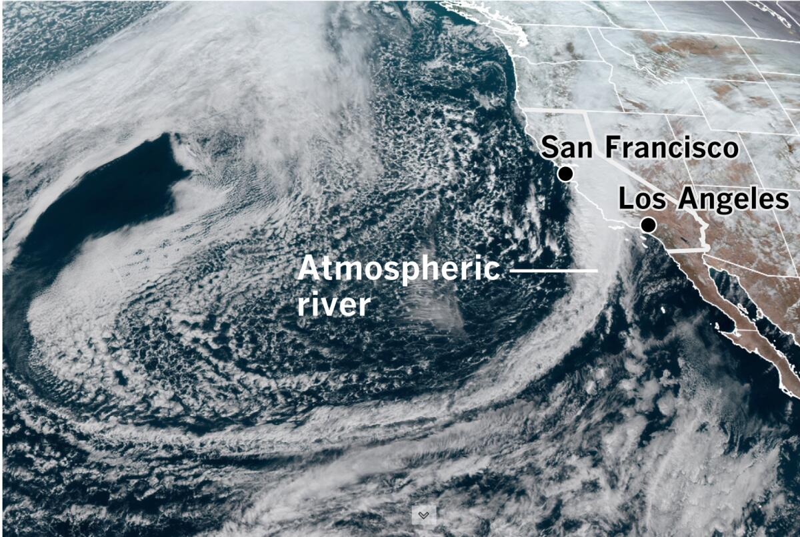
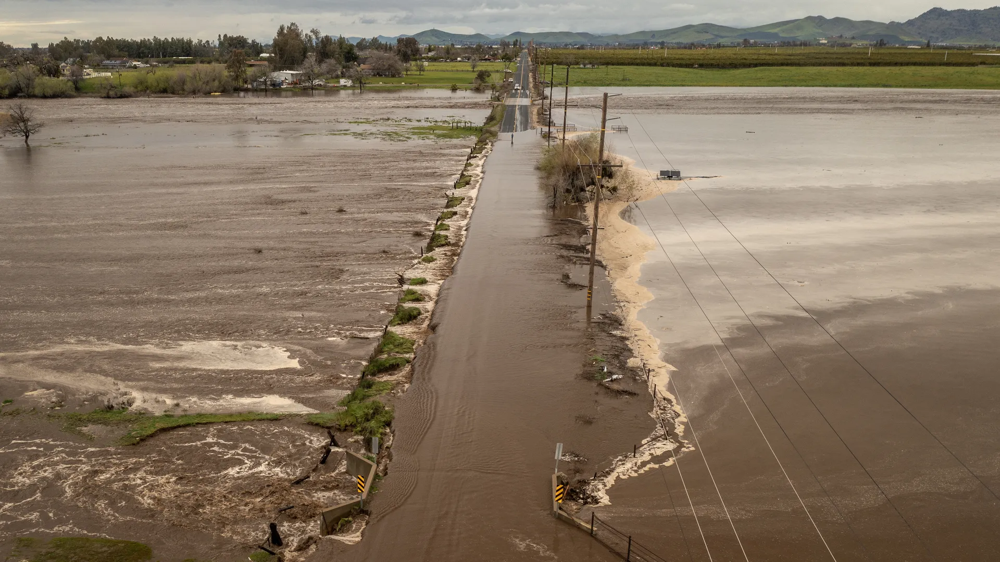

Land-Sea Connections: Investigating Ecosystem Transitions Across Ocean Margins
======
Shailja's research employs oceanographic observations to investigate planktonic ecosystem dynamics from river-influenced coastal waters to the offshore open ocean. Shailja's  [teaching](https://shailjagangrade.github.io/teaching/) also centers around marine ecosystem dynamics, in particular the exploration of how ecosystems are shaped by environmental conditions and gradients -- as well as human impacts.

Coastal upwelling dynamics & phytoplankton communities
------
Wind-driven coastal upwelling is spatially and temporally dynamic. Upwelling-favorable winds drives "pulses" of nutrient-rich water into the sunlit water column. This process results in the development of phytoplankton patches at the coast that are rapidly transported offshore. Identifying the location and composition of these patches is important in diagnoising potential ecological hotspots and feeding grounds for zooplankton, fishes, seabirds, and marine mammals.

Relevant publications:
  * Gangrade, S., & Franks, P. J. S. (2023). Phytoplankton patches at oceanic fronts are linked to coastal upwelling pulses: Observations and implications in the California Current System. Journal of Geophysical Research: Oceans, 128, e2022JC019095. https://doi.org/10.1029/2022JC019095
  * Gangrade, S., Franks, P.J.S., Forsch, K.O. and Barbeau, K.A. (2025), Salinity is diagnostic of maximum potential chlorophyll and phytoplankton community structure in an Eastern Boundary Upwelling System. Limnol. Oceanogr. Lett, 10: 923-933. https://doi.org/10.1002/lol2.70059

(Sub)mesoscale ocean stirring & plankton succession
------
Swirling ocean currents are able to tranport passively drifting plankton hundreds of kilometers within several days. Therefore, as entire planktonic ecosystems are transported, they also undergo ecological succession: communities shift from large to small phytoplankton, and zooplankton such as copepods proliferate in response to prey populations. Stationary measurements by ships or sensor platforms often only capture a "patch" of plankton passing by, but particle-tracking techniques allow us to reconstruct the histories of water parcels to evaluate how ecosystems change along these trajectories.

Relevant publications & upcoming presentations:
  * Gangrade, S. and Mangolte, I. (2024), Patchiness of plankton communities at fronts explained by Lagrangian history of upwelled water parcels. Limnol Oceanogr, 69: 2123-2137. https://doi.org/10.1002/lno.12654
  * Stukel. M.R., Allen, A.E, Barbeau, K.A., Chabert, P., Dovel S., Gangrade, S., Kranz, S.A., Lampe, R.H., Landry, M.R., Marrec, P., Messie, M., Miller, A.J., Wilkinson, G., & Ohman, M.D. (2025), Disturbance ecol- ogy in a pelagic upwelling biome: Lagrangian frameworks for studying succession, BioScience, 2025;, biaf144, https://doi.org/10.1093/biosci/biaf144
  * Gangrade, S., Freilich, M. A., Omand, M. M., Beaudin, E. (2026). Ecological responses of planktonic communities to submesoscale ocean eddy stirring and mixing. Ocean Sciences Meeting, Glasgow, Scotland. https://agu.confex.com/agu/osm26/meetingapp.cgi/Paper/2025926

Ecological impacts of extreme terrestrial precipitation 
------
Extreme precipitation events on land can result in high amounts of freshwater discharge into the ocean, with important implications for nutrient and carbon cycling. By using a combination of physical and biogeochemical measurements, we can evaluate how freshwater communities might be distinct from surrounding ocean waters, and we can characterize the rapid transport of such waters into offshore oligotrophic (low-nutrient) regions.

<!-- 
Image credit: NOAA and LA Times
 -->

Image credit: NOAA and LA Times

Relevant publications & upcoming presentations:
  * Freilich, M. A., Gangrade, S., et al. (2026), Submesoscale Eddy Dispersion Affects Community Composition and Biogeochemistry Beyond the Coastal Upwelling Zone. Ocean Sciences Meeting, Glasgow, Scotland. https://agu.confex.com/agu/osm26/meetingapp.cgi/Paper/2040489

<!-- 

 -->
