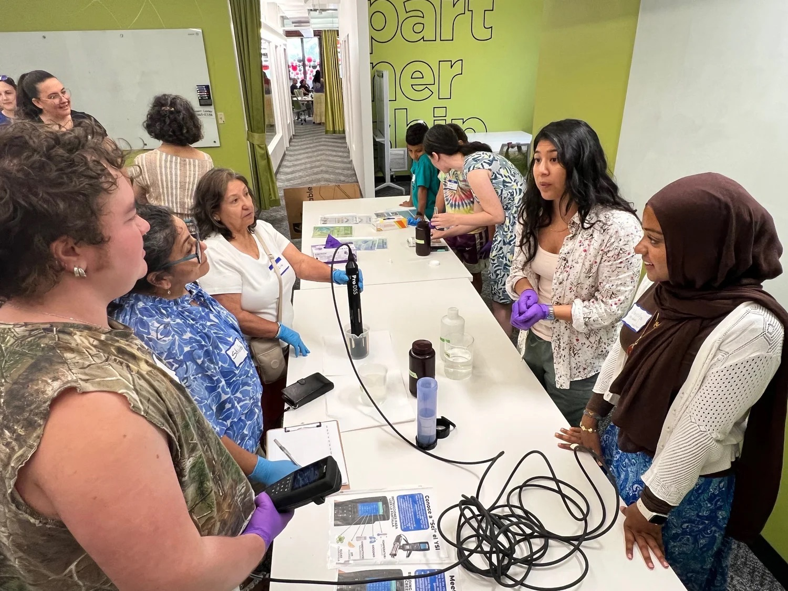
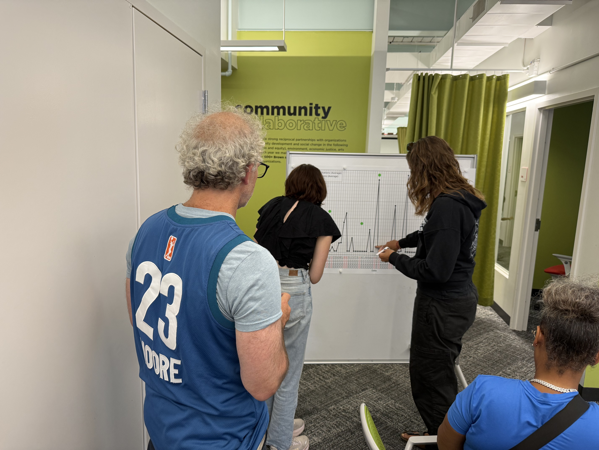
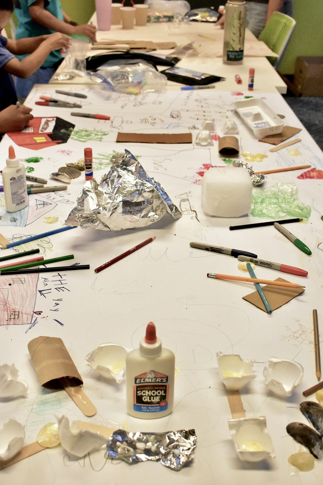
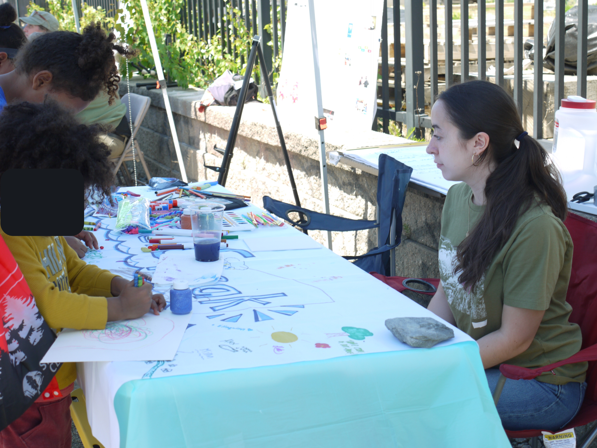
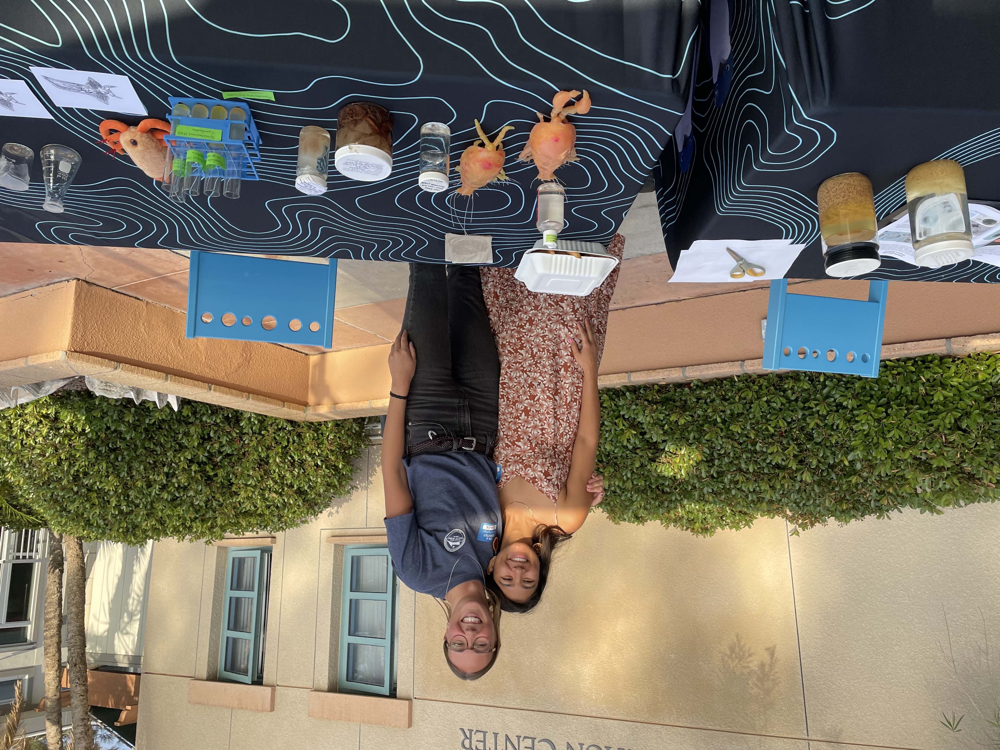

# WaterSpeak: A Community-Powered Environmental Monitoring Program

## Water Quality Data Explorations
Through collaboration with the People's Port Authority, we have been engaging with a multi-generational community cohort to build an environmental monitoring and sampling program. Together, we have developed a regular water quality sampling strategy and have been working to establish and improve scientific literacy within the cohort.

 <em> Community scientists learning how water quality sampling instruments function and measuring some test samples. </em> 

 <em> Community cohort engaging with water quality data, constructing a time-series plot of chlorophyll at Public Street Shoreline Access from summer 2026 </em> 

## WaterSpeak Art Collective
Supported by a Skype A Scientist Science Communication grant, we have created opportunities for community members to explore their personal connections with water, the shoreline, and the Port of Providence neighborhood.

 <em> Youth engaging with craft materials to construct a map of the neighborhood, highlighting the places and symbols that resonate with them. </em> 

 <em> Community members drawing a banenr for the WaterSpeak program. </em> 

# Public Outreach & Science Journalism

## Scripps Community Outreach for Public Education
As an outreach coordinator, Shailja developed and executed public tours and educational programming for the Scripps Community Outreach for Public Education organization. She communicated several different research aims of the Scripps Institution of Oceanography and designed events that engaged with community members of different ages and backgrounds.

 <em> Shailja, with Jamee Adams (left), presenting about plankton ecology and oceanographic sampling at Birch Aquarium at Scripps public event. </em> 

## ASLO Journalist for a Day - Article Feature
Shailja participated in the ASLO Journalist for a Day program and had the opportunity to interview researchers at the 2020 Ocean Sciences Meeting and write a research feature article, published in the Limnology and Oceanography Letters journals. The article can be found [here]([url](https://aslopubs.onlinelibrary.wiley.com/doi/10.1002/lob.10387)).

