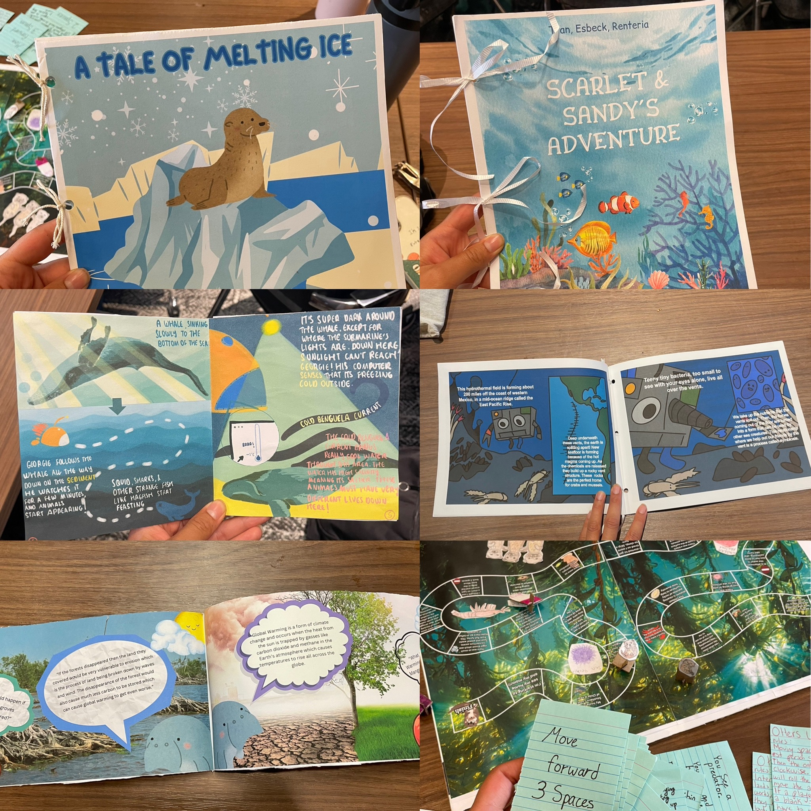
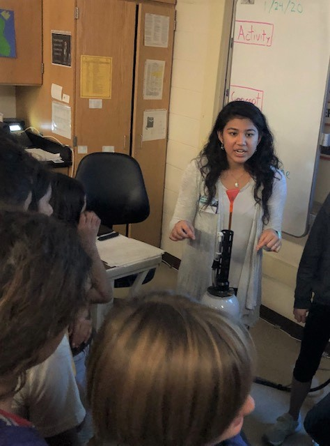

# Teaching Philosophy
----------

> My primary goal as an instructor is to demystify the ocean by helping students build a fundamental and nuanced understanding of the ocean as an interconnected and dynamic system. Students arrive in the classroom with a wide range of exposure to and previous knowledge about the ocean: some live in land-locked regions and have only witnessed the ocean through popular media; others are avid surfers, snorkelers, or fishers. By using this spectrum of experiences as points of reflection, embedded in course discussion and activities, I encourage students to consider marine ecosystems from different societal and scientific perspectives. Ultimately, I want students to walk away from my courses with a sense of joy and wonder, but also an idea of how they might be able to interact, study, or examine marine ecosystems with a science-driven, dynamical mindset.

# Courses
----------

## 2026 (Expected)
### How the Ocean Feeds Alaska: Investigating Marine Ecosystem Dynamics

*Brown University Environmental Leadership Lab Course (sole, lead instructor)*
  * *Course Description*: During this course, we  explore fundamental concepts in marine ecology and oceanography to assess how the ocean around Alaska supports critical commercial fisheries and subsistence living practices. Through a combination of lectures, data explorations, and site visits, students gain a technical understanding of coastal Alaskan ecosystems and collect traditional ecological knowledge, ultimately applying these perspectives to evaluate how changing climate conditions affect communities that rely on the ocean for food.

## 2025

### Undergraduate Research Fundamentals & Professional Development
*Brown University DEEPS REU Program (co-instructor)*
  * *Description*: Shailja and two graduate students developed and led a workshop series for summer undergraduate research interns. The workshop guided students through various steps of the research process, including reading sceintific articles, formulating hypotheses, writing abstracts, and composing posters and oral presentations. The workshop leaders also organized and moderated professional development opportunities, including graduate student and faculty panels, and provided supplemental research mentorship support.

## 2024

### Ocean Ecosystem Dynamics

*UC San Diego Academic Connections Pre-College Course, In-Person (sole, lead instructor)*
  * *Course Description*: During this course, students are introduced to the biological and physical dynamics of ocean ecosystems. In particular, we explore the key physical, biological, and chemical characteristics of a variety of ocean ecosystems (e.g., coral reef, open ocean, deep-sea whale fall), as well as important interactions and relationships between organisms. This course includes field trips that highlight local marine ecosystems (e.g., rocky intertidal zone, tidal marsh, sandy beach, pelagic invertebrate collections) and hands-on activities that involve the use of real scientific data collected by local research platforms and programs (e.g., SIO pier data, California long-term monitoring sites). Students work on a final project that involves the creative implementation of science communication principles: students select a non-technical format (e.g., children's storybook, board game) to present scientific data and information about a particular marine ecosystem.

 <em> Sample student final projects from Ocean Ecosystem Dynamics course. </em> 

### Undergraduate Seminar: Perspectives on Ocean Sciences

*Scripps Institution of Oceanography, UC San Diego - SIO 90 (sole, lead instructor)*
  * *Course Description*: Scripps Institution of Oceanography (SIO) is a nexus of interdisciplinary science and knowledge, ranging from field-based marine biology to modeling-based climate science. This undergraduate seminar hosts a different speaker each week, exposing students to the variety of research conducted at SIO. Weekly seminars are supplemented by instructor-led workshops on professional development (e.g., applying for  internships, networking, how to contact faculty, etc.). This seminar course also culminates in a field trip to the SIO Research Pier.

## 2023

### Ocean Ecosystem Dynamics

*UC San Diego Academic Connections Pre-College Course, Online (sole, lead instructor)*
  * *Course Description*: This course is designed to introduce students to the biological and physical dynamics of ocean ecosystems. This class will explain “who” lives in the oceans, “what” types of organisms they are, “why” they live there, and “how” the ocean environment supports life. This class will describe a wide scope of marine life, from microscopic organisms (bacteria) to the planet’s largest animals (blue whales). We will also discuss the most important requirements for life in an ocean environment, including physical variables such as light and oxygen, and biological variables, such as predators and prey. Finally, this class will cover the impacts of human activity and climate change on a few key marine ecosystems. Through lectures and group discussions, students will be introduced to several marine ecosystems. To synthesize the information learned in class, students will choose any marine ecosystem that interests them, and in an individual presentation, they will articulate the “who, what, how, and why” of life in that ecosystem, as well as the current impacts of human activity/climate change it faces.

  <em> Course field trip to rocky intertidal zone in La Jolla, CA. </em> 

## 2020-2023

### Ocean Warming & Ocean Acidification

*[Stay Cool for Grandkids](https://staycool4grandkids.org) Ocean Climate Science Program (co-instructor)*
  * *Course Description*: This course introduced middle-school students in San Diego County to the concepts of ocean warming and ocean acidification. Students were guided to interpret plots of ocean temperature & pH, and to discuss the broader ecological and societal implications of anthropogenic climate change. Students were also guided through hands-on demonstrations involving Argo floats and pH-change experiments.

 <em> Shailja demonstrates how an ARGO float is used to sample ocean temperatures. </em> 

